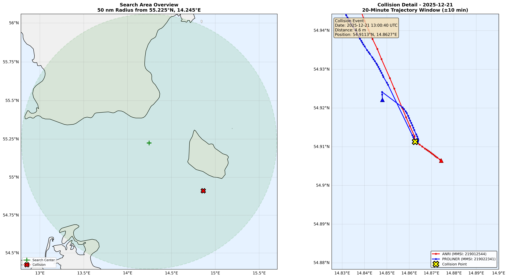

# AIS Collision Detection

A PySpark pipeline for detecting vessel collision events and near-misses using AIS (Automatic Identification System) data from the Danish Maritime Authority.

## Table of Contents

1. [Detected Event](#detected-event)
2. [Methodology](#methodology)
   - [Data Source](#data-source)
   - [Pipeline Stages](#pipeline-stages)
   - [Collision Criteria](#collision-criteria)
3. [Data Setup](#data-setup)
4. [Usage](#usage)
   - [Docker (Recommended)](#docker-recommended)
   - [Local](#local)
5. [Output](#output)

## Detected Event



On **2025-12-21 at 13:00:40 UTC**, the pipeline identified a close-quarters encounter between two pleasure craft in the Baltic Sea near 54.9113°N, 14.8627°E:

| Vessel | MMSI | Type | Role |
|--------|------|------|------|
| ANRI | 219012544 | Pleasure | Overtaking vessel |
| PROLINER | 219022341 | Pleasure | Vessel being overtaken |

**Minimum distance:** 4.6 meters

**Event classification:** Overtaking near-miss. Both vessels were proceeding south on similar courses when ANRI closed to within AIS accuracy range while overtaking PROLINER. ANRI subsequently altered course approximately 10° to port, consistent with an avoidance maneuver.

## Methodology

### Data Source
- 31 days of AIS data (December 2025) from the Danish Maritime Authority
- Search area: 50 nautical mile radius centered on 55.225°N, 14.245°E

### Pipeline Stages

1. **Spatial Filtering** — Bounding box pre-filter followed by Haversine distance calculation
2. **Data Quality** — Null/invalid coordinate removal, SOG range validation
3. **GPS Jump Detection** — Coordinate movement thresholds to filter AIS noise
4. **Vessel Filtering** — Stationary vessel removal (SOG < 1.0 knot), service vessel exclusion (pilot, tug, SAR, etc.), fishing vessel exclusion
5. **Temporal Aggregation** — 40-second windows to reduce ping frequency noise
6. **Spatiotemporal Join** — Self-join on time bucket and spatial grid (0.01° cells)
7. **Distance Calculation** — Haversine formula between vessel pairs
8. **Deduplication** — Encounter grouping with 5-minute gap threshold, closest-point selection

### Collision Criteria

| Parameter | Value | Rationale |
|-----------|-------|-----------|
| Collision distance | ≤ 5 meters | Within AIS accuracy range |
| Time tolerance | ≤ 10 seconds | Simultaneous positions |
| Minimum SOG | > 1.0 knot | Both vessels underway |
| Encounter gap | > 5 minutes | Separate close-quarters events |

## Data Setup

The pipeline expects AIS data in CSV format within the `data/` directory. 

To download the December 2025 dataset from the Danish Maritime Authority, use the provided script which fetches all files in parallel:

```bash
chmod +x dl-data.sh
./dl-data.sh
```

Alternatively, you can place your own .csv files directly into the `data/` folder. The schema will be automatically inferred from the files present.

## Usage
### Docker (Recommended)

Pull the image from Docker Hub and run the pipeline with your local data and results directories mounted

https://hub.docker.com/r/tabeh/ais-collision-detector

```bash
# Pull the image
docker pull tabeh/ais-collision-detector:latest

# Run the pipeline
docker run -it --rm \
  -v \$(pwd)/data:/app/data \
  -v \$(pwd)/results:/app/results \
  tabeh/ais-collision-detector:latest
```

Note: The `-v` flags mount your local directories into the container. Ensure your AIS CSV files are in the `data/` folder before running. The output visualization and CSVs will be saved to your local `results/` folder.

To build the image locally from the Dockerfile:

```bash
docker build -t ais-collision-detector .
```

and run it with:

```bash
docker run -it --rm \
  -v $(pwd)/data:/app/data \
  -v $(pwd)/results:/app/results \
  ais-collision-detector
```
### Local

If you prefer to run the scripts directly without Docker, ensure you have Python 3.8+, Java, and the required system libraries (GEOS, PROJ) installed.

```bash
# Install Python dependencies
pip install -r requirements.txt

# Run the orchestrator
python main.py
```

## Output

Upon completion, the following files will be generated in the `results/` directory:

- `collision_event.csv` — Collision event details
- `collision_trajectory.csv` — 20-minute trajectory data (10 min around the event)
- `collision_trajectory.png` — Visualization with search area overview and trajectory detail