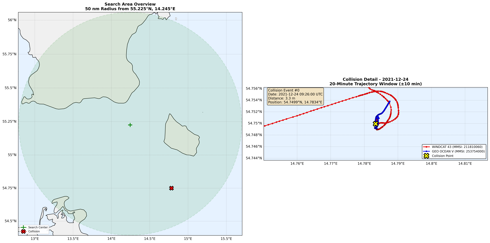
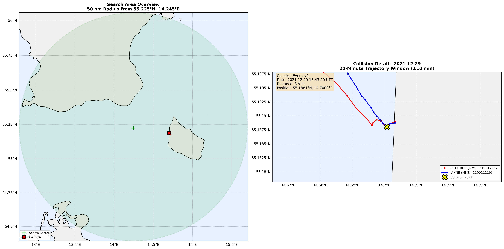
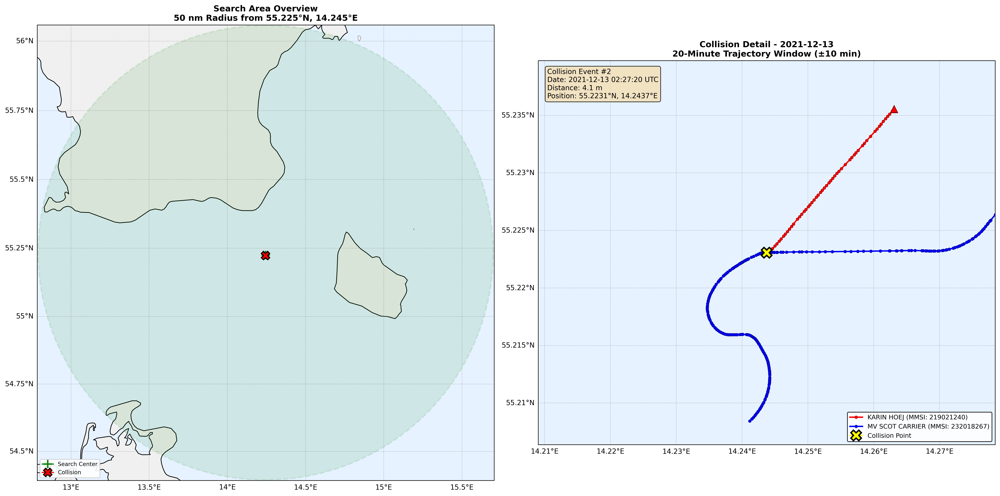

# AIS Collision Detection

A PySpark pipeline for detecting vessel collision events and near-misses using AIS (Automatic Identification System) data from the Danish Maritime Authority.

## Table of Contents

1. [Detected Events](#detected-events)
   - [Ranking](#final-ranking-by-collision-likelihood)
3. [Methodology](#methodology)
   - [Data Source](#data-source)
   - [Pipeline Stages](#pipeline-stages)
   - [Performance Optimizations](#performance-optimizations)
   - [Collision Criteria](#collision-criteria)
4. [Usage](#usage)
   - [Docker (Recommended)](#docker-recommended)
   - [Local](#local)
5. [Output](#output)

## Detected Events

**Event #0 (2021-12-24): WINDCAT 43 & GEO OCEAN V**



1. **Low-speed interaction** (both < 2 knots)
2. The HSC's turn from ~3° to ~272° happens at **very low speed** (0.2-1.5 knots)
3. This could represent:
   - **Maneuvering** in close quarters (turning to avoid)
   - **Low-speed contact** (bumping at low speed)
   - **Station-keeping/navigation** near a stationary object

The fact that **both vessels essentially stop moving** (SOG ~0.1-0.8 knots) for several minutes around 09:22 suggests this might be:
- **Docking/berthing operation** 
- **Station-keeping** near a fixed point
- **Very low-speed near-miss**

---

**Event #1 (2021-12-29): SILLE BOB & JANNE**



Looking at the behavior:
- Both pleasure vessels decelerate to 0.0-0.9 knots at the closest point.
- They remain in extremely close proximity (~3.9m) for an extended period.
- Both show coordinated, gentle turning movements afterward.

This **could** represent:
1. A low-speed collision between maneuvering pleasure craft
2. Or a docking maneuver where one vessel comes alongside another

The sustained very close proximity near shore and simultaneous near-stop are more characteristic of intentional docking than an accidental high-energy collision.

---

**Event #2 (2021-12-13): KARIN HOEJ & MV SCOT CARRIER**



- **Vessel 232018267 (Cargo)**: Maintains a steady 12 knots until **02:27:29**, then shows a dramatic, unnatural deceleration sequence: 11.1 → 10.1 → 8.0 → 7.0 → 6.1 → 5.1 → 4.7 → 3.9 → 3.4 → 3.0 knots within ~3 minutes.
- **Simultaneous course change**: Its COG shifts from ~269° to ~270°, then begins erratic swinging (267°, 263°, 258°, etc.) – consistent with loss of control or evasive action.
- **Sudden cessation of transmissions**: 219021240 losing trajectory data at the **exact moment** both vessels show abnormal kinematic changes (speed drop, course change) is highly suspicious.

Possible reasons for AIS signal loss at that instant:
   - **Power failure** (collision damage to electrical systems)
   - **Antenna/transceiver damage** (physical impact)
   - **Vessel sinking or listing** causing antenna submersion
   - **Intentional shutdown** in an emergency (unlikely but possible)
   - **Equipment malfunction** coinciding exactly with the encounter (statistically improbable)

This **simultaneous, abrupt deceleration and course disruption** strongly suggests an impact. The cargo vessel's rapid slowdown from 12 to 3 knots isn't normal operation; it's indicative of emergency maneuvering or collision damage.

---

### Final Ranking by Collision Likelihood

1. **Event #2** → **Highest likelihood of true collision**  
   - Kinematic disruption + simultaneous AIS failure in one vessel + continued but abnormal track in the other.
2. **Event #1** → **Possible collision or docking**  
   - Both vessels remain active post‑encounter; low speeds throughout.
3. **Event #0** → **Least convincing as collision**  
   - Low‑speed interaction; resembles station‑keeping or close maneuvering.

## Methodology

### Data Source
- 31 days of AIS data (December 2021) from the Danish Maritime Authority
- Search area: 50 nautical mile radius centered on 55.225°N, 14.245°E

### Pipeline Stages

1. **Spatial Filtering** — Bounding box pre-filter followed by Haversine distance calculation
2. **Data Quality** — Null/invalid coordinate removal, SOG range validation
3. **GPS Jump Detection** — Coordinate movement thresholds to filter AIS noise
4. **Vessel Filtering** — Stationary vessel removal (SOG < 1.0 knot), service vessel exclusion (pilot, tug, SAR, etc.), fishing vessel exclusion
5. **Temporal Aggregation** — 40-second windows to reduce ping frequency noise
6. **Spatiotemporal Join** — Self-join on time bucket and spatial grid (0.01° cells)
7. **Distance Calculation** — Haversine formula between vessel pairs
8. **Deduplication** — Encounter grouping with 5-minute gap threshold, closest-point selection

### Performance Optimizations

Processing a month of AIS data (tens of millions of records) requires careful resource management. Key optimizations include:

- **PySpark over Pandas** — Distributed processing handles datasets larger than memory, with lazy evaluation avoiding unnecessary computation
- **Bounding box pre-filter** — Simple lat/lon range comparison eliminates ~95% of records before the expensive Haversine distance calculation
- **Spatial grid bucketing** — 0.01° grid cells (~1km) constrain the self-join to only compare vessels in the same geographic area, preventing an O(n²) explosion of pairs
- **Temporal aggregation** — 40-second windows reduce ping frequency noise and dramatically shrink the join space
- **Strategic caching** — `.persist(StorageLevel.MEMORY_AND_DISK)` at critical boundaries (after filtering, before the join) breaks the lineage chain and avoids recomputing the entire pipeline on each action
- **Coordinate movement filter** — Simple Euclidean distance between consecutive pings (`sqrt(Δlat² + Δlon²)`) for GPS jump detection, avoiding an additional Haversine computation per record
- **Intermediate column decomposition** — Breaking the Haversine formula into separate `withColumn` steps prevents deeply nested expression trees that exceed Python's recursion limit and complicate Spark's query optimizer

### Collision Criteria

| Parameter | Value | Rationale |
|-----------|-------|-----------|
| Collision distance | ≤ 5 meters | Within AIS accuracy range |
| Time tolerance | ≤ 10 seconds | Simultaneous positions |
| Minimum SOG | > 1.0 knot | Both vessels underway |
| Encounter gap | > 5 minutes | Separate close-quarters events |

**Note:** Due to the mass of these vessels they possess tremendous kinetic energy even at low speeds and the use of proximity as the main indicator can produce false positives.

## Usage
### Docker (Recommended)

Pull the image from Docker Hub ([link](https://hub.docker.com/r/tabeh/ais-collision-detector)) and run the pipeline with your local data and results directories mounted

```bash
# Pull the image
docker pull tabeh/ais-collision-detector:latest

# Run the pipeline
docker run -it --rm \
  -v \$(pwd)/data:/app/data \
  -v \$(pwd)/results:/app/results \
  tabeh/ais-collision-detector:latest
```

Note: The `-v` flags mount your local directories into the container. Ensure your AIS CSV files are in the `data/` folder before running. The output visualization and CSVs will be saved to your local `results/` folder.

To build and run the image locally using the Dockerfile:

```bash
# Build
docker build -t ais-collision-detector .

# Run
docker run -it --rm \
  -v $(pwd)/data:/app/data \
  -v $(pwd)/results:/app/results \
  ais-collision-detector
```
### Local

If you prefer to run the scripts directly without Docker, ensure you have Python 3.8+, Java, and the required system libraries (GEOS, PROJ) installed.

```bash
# Install Python dependencies
pip install -r requirements.txt

# Run the orchestrator
python main.py
```

## Output

Upon completion, the following files will be generated in the `results/` directory:

- `collision_event.csv` — Collision event details
- `collision_trajectory.csv` — 20-minute trajectory data (10 min around the event) for each event
- `collision_event_i.png` — Visualizations with search area overview and trajectory detail for each event
